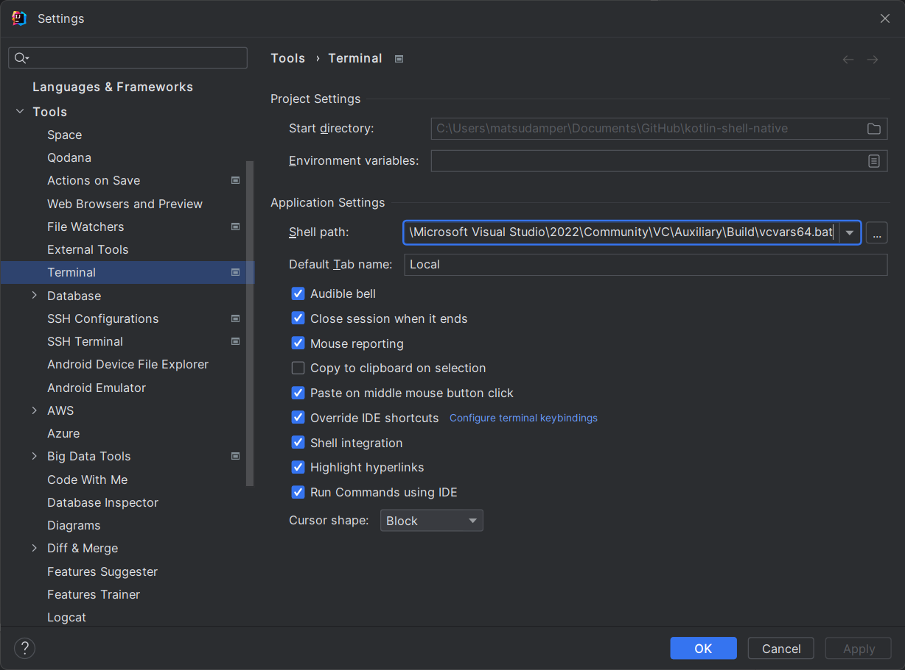

# Develop
## Windows
setup  
https://medium.com/graalvm/using-graalvm-and-native-image-on-windows-10-9954dc071311  
Build using `vcvars64.bat`, `C:\ProgramData\Microsoft\Windows\Start Menu\Programs\Visual Studio 2022\Visual Studio Tools\VC\x64 Native Tools Command Prompt for VS 2022`.

Set to IntelliJ shell.  

